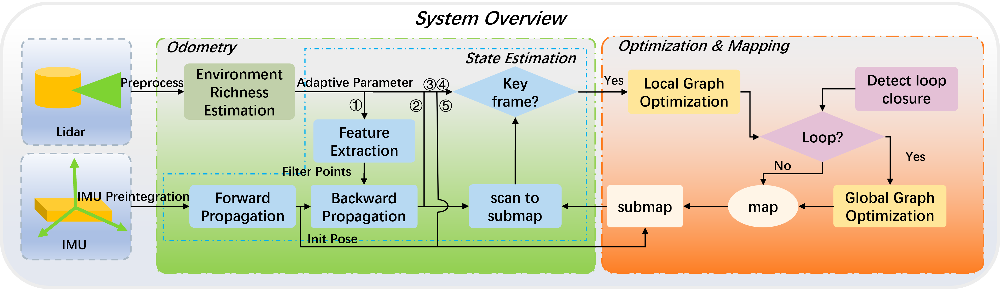

# E-AdapLIO

**E-AdapLIO** is an entropy-based adaptive LiDAR–Inertial Odometry (LIO) system built on top of the [LIO-SAM](https://github.com/TixiaoShan/LIO-SAM) framework. By estimating environmental information richness via information entropy, E-AdapLIO adaptively adjusts key parameters at runtime to balance accuracy, robustness, and computational cost.

---

## System Architecture

    

---

## Key Differences from [LIO-SAM](https://github.com/TixiaoShan/LIO-SAM)

- **Operating System**: Ubuntu 20.04 LTS  
- **ROS Distribution**: ROS Noetic  
- **GTSAM Version**: 4.0.3  
- **C++ Standard**: C++14  
- Other dependencies and folder/package structure remain the same as original [LIO-SAM](https://github.com/TixiaoShan/LIO-SAM).

---

## Dataset

We have collected a private dataset, available for download here:  
**Link:** https://pan.baidu.com/s/16uxEQeu7Yyi2BRCGxegUAg?pwd=pe6b  
**Extraction code:** pe6b  

---

## Livox Mid360 Support

To run E-AdapLIO with the Livox Mid360 sensor, you can refer to the setup in [LIO-SAM-MID360](https://github.com/nkymzsy/LIO-SAM-MID360). Simply follow their ROS-Noetic configuration and migrate our entropy-based adaptive module into that workspace.

---

## Video

Video is available at:
https://youtu.be/lKyfxn92AmA

---

## Acknowledgements

- We gratefully acknowledge the authors of **[LIO-SAM](https://github.com/TixiaoShan/LIO-SAM)** (Tixiao Shan et al.) for releasing their factor-graph based LIO framework, which serves as the foundation for our work.  
- Thanks to the maintainers of **[LIO-SAM-MID360](https://github.com/nkymzsy/LIO-SAM-MID360)** for their Mid360 integration, which we leverage for Livox support.  
- This project benefits from numerous open-source dependencies (PCL, Eigen, ceres-solver, etc.); we extend our gratitude to all contributors in those communities.
